Rack-Scale
==========

Each node contains CPU, memory, and disk.

Flow Sizes
==========

Memory Only
-----------

Pre-Disaggregation | Uncombined | Combined |Combined on Time Only
-------------------|------------|----------|---------------------
|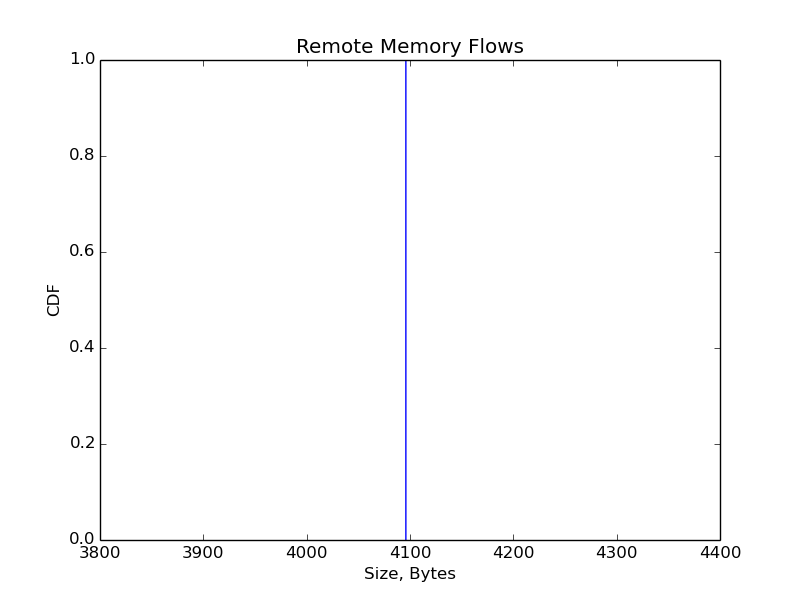|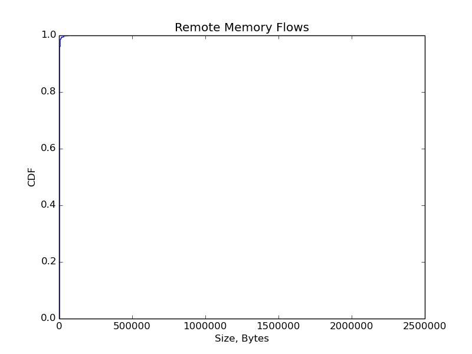|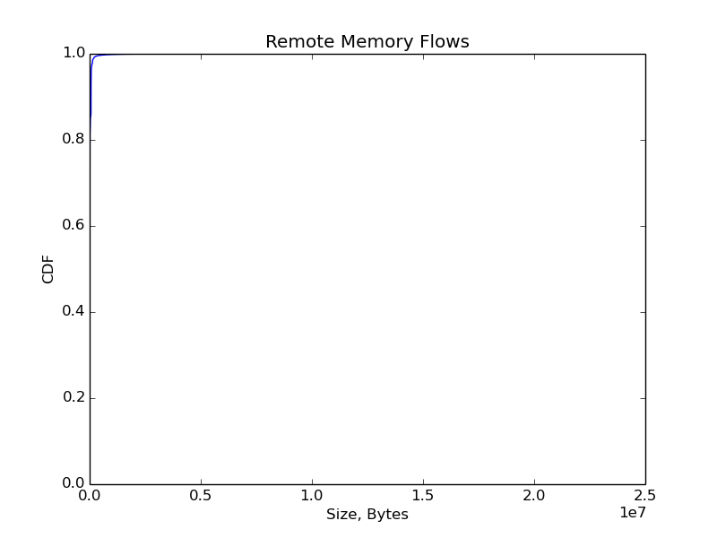

Disk Only
---------

Pre-Disaggregation | Uncombined | Combined |Combined on Time Only
-------------------|------------|----------|---------------------
| |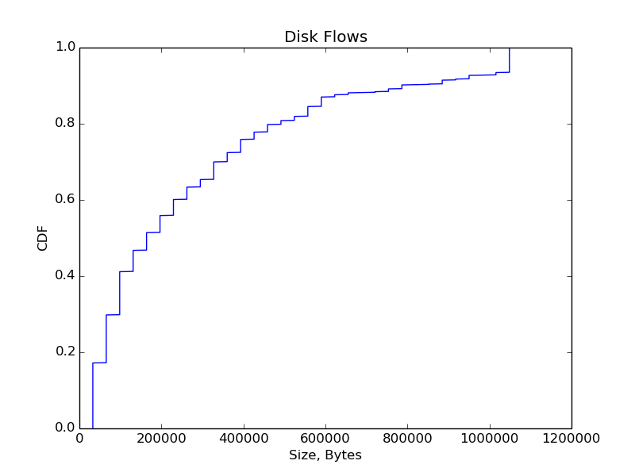 |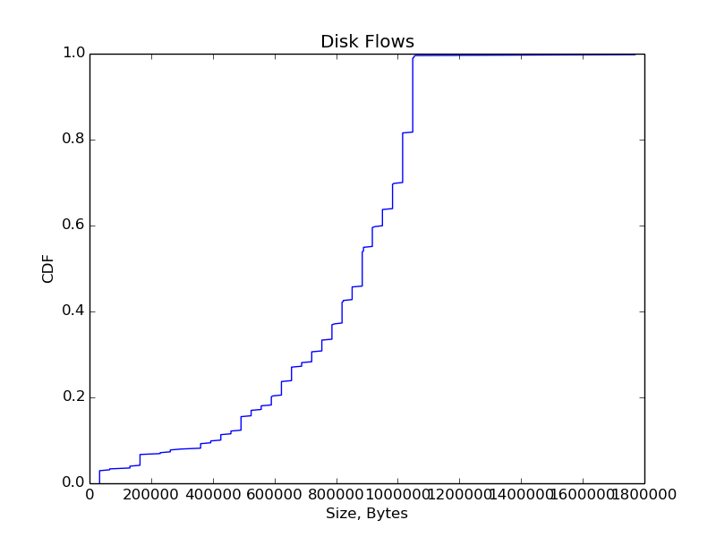

All Flows
---------

Pre-Disaggregation | Uncombined | Combined |Combined on Time Only
-------------------|------------|----------|---------------------
 | 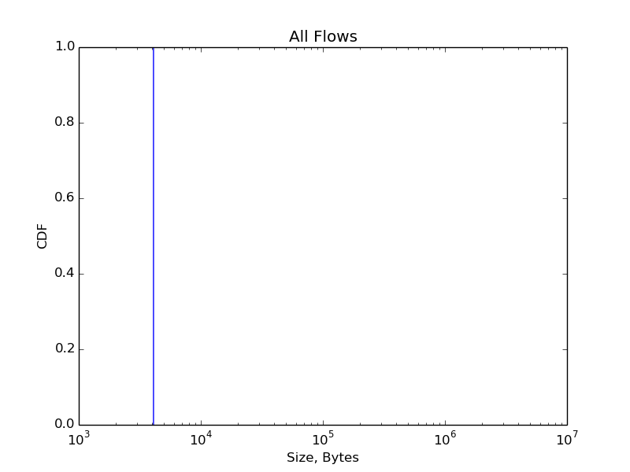        |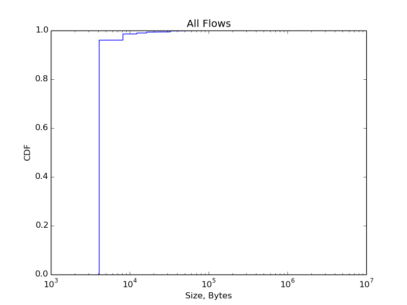        |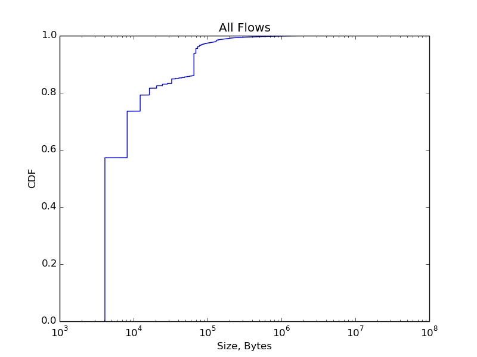

Interarrivals
=============

Pre-Disaggregation | Uncombined | Combined |Combined on Time Only
-------------------|------------|----------|---------------------
 |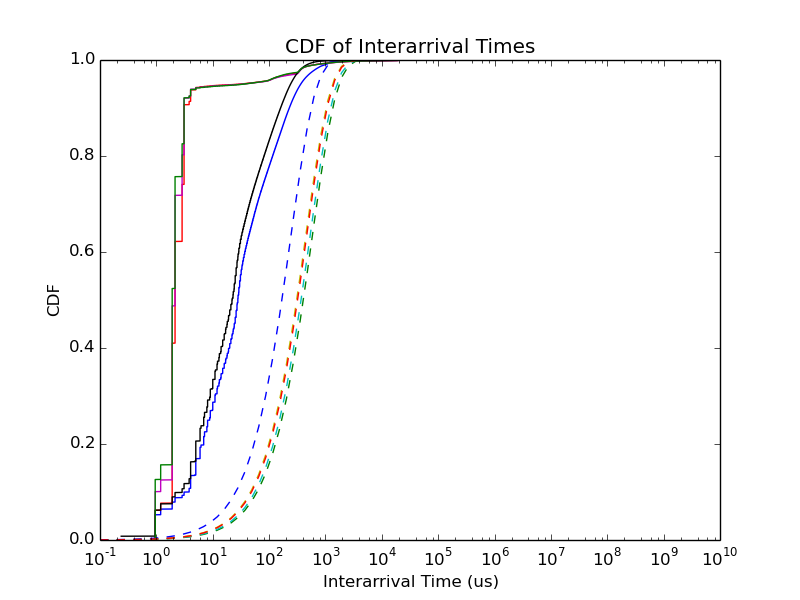| 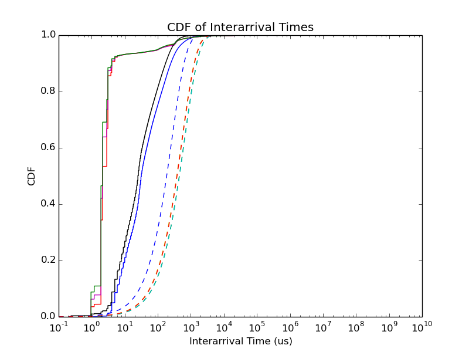|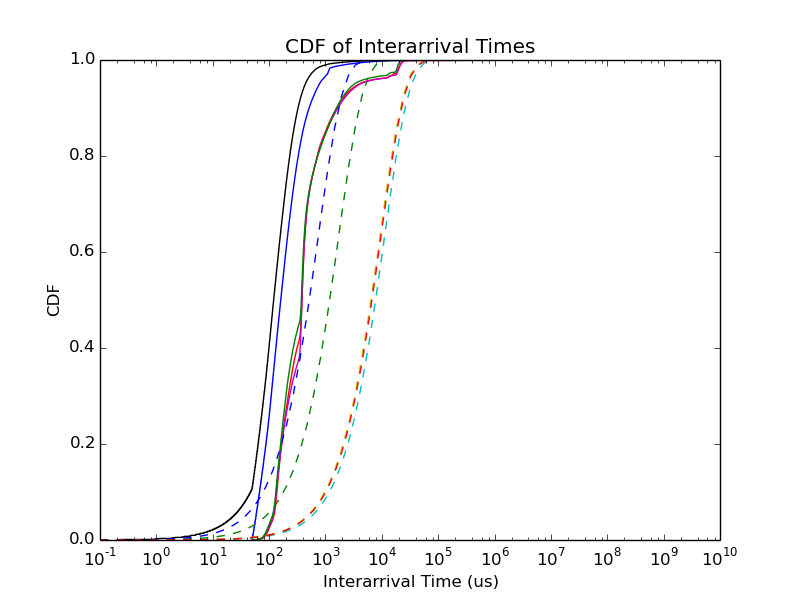
              |             | ![PDF of Interarrival Times]  (./rack-scale_combined_pdf_src_interarrivals.png)             |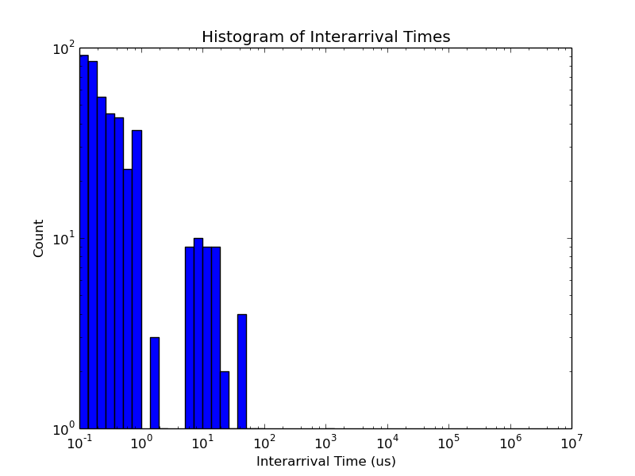             

Traffic Volume
==============

Pre-Disaggregation | Uncombined | Combined |Combined on Time Only
-------------------|------------|----------|---------------------
|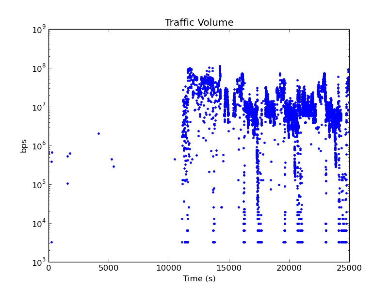      | |
 |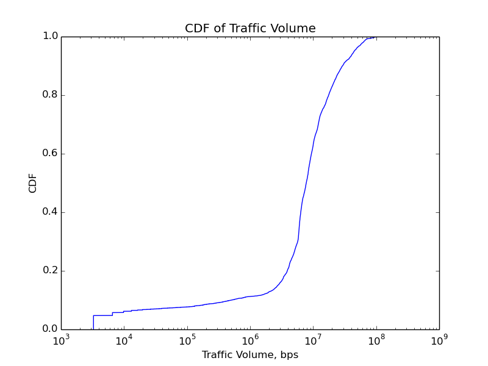  | |
 |  | |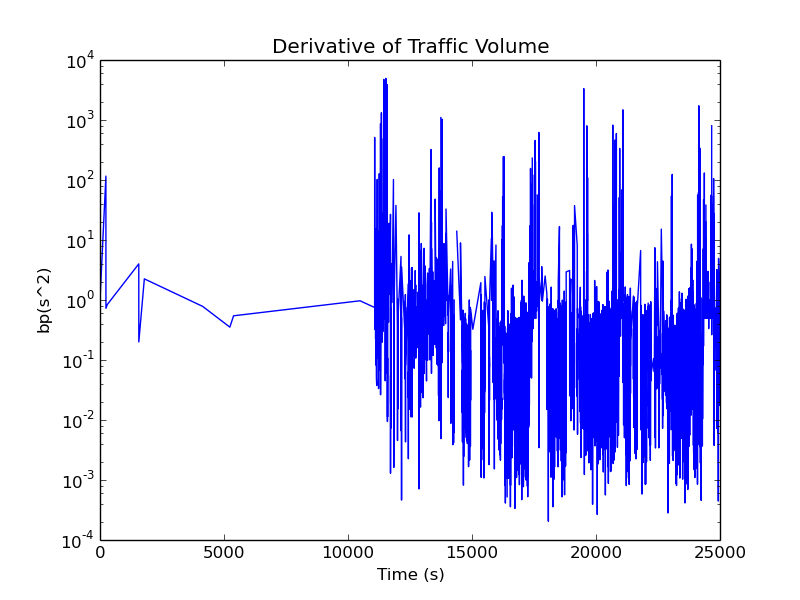

Resource-Based
==========

Each node contains *either* CPU, memory, *or* disk. (There are more nodes in the network overall).

Flow Sizes
==========

Memory Only
-----------

Pre-Disaggregation | Uncombined | Combined |Combined on Time Only
-------------------|------------|----------|---------------------
|||

Disk Only
---------

Pre-Disaggregation | Uncombined | Combined |Combined on Time Only
-------------------|------------|----------|---------------------
| | |

All Flows
---------

Pre-Disaggregation | Uncombined | Combined |Combined on Time Only
-------------------|------------|----------|---------------------
 |         |        |

Interarrivals
=============

Pre-Disaggregation | Uncombined | Combined |Combined on Time Only
-------------------|------------|----------|---------------------
 || 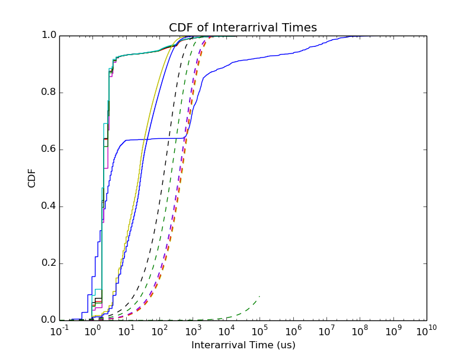|
              |             | ![PDF of Interarrival Times]  (./res-based_combined_pdf_src_interarrivals.png)             |             

Traffic Volume
==============

Pre-Disaggregation | Uncombined | Combined |Combined on Time Only
-------------------|------------|----------|---------------------
|      | 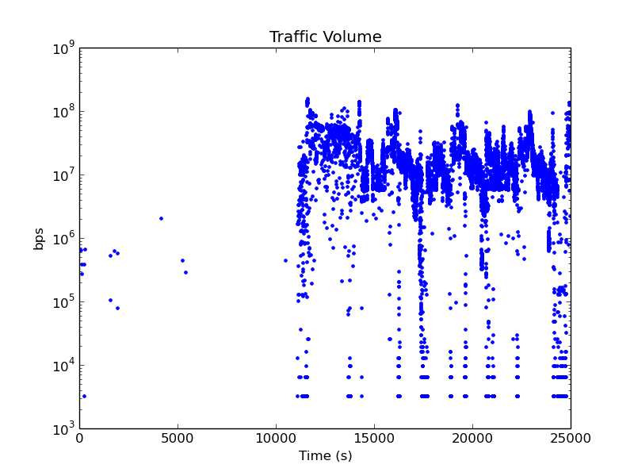|
 |  | 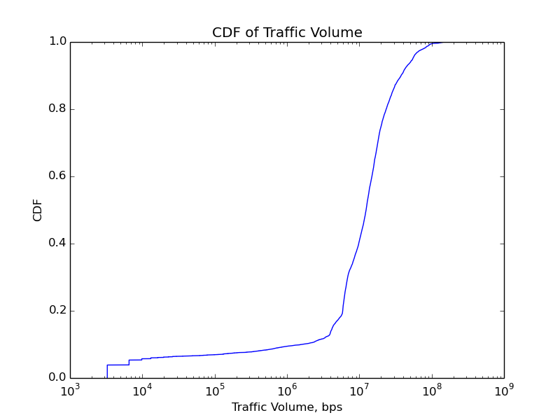|
 |  | 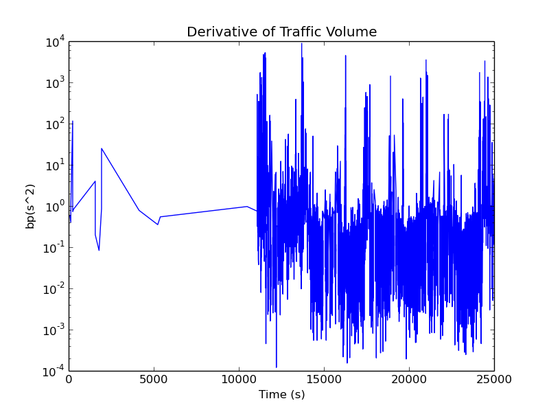|

