Flow Sizes
==========

Memory Only
-----------

Uncombined                            | Combined                                      |Delta = 1000
--------------------------------------|-----------------------------------------------|----------------------------------------------------------
|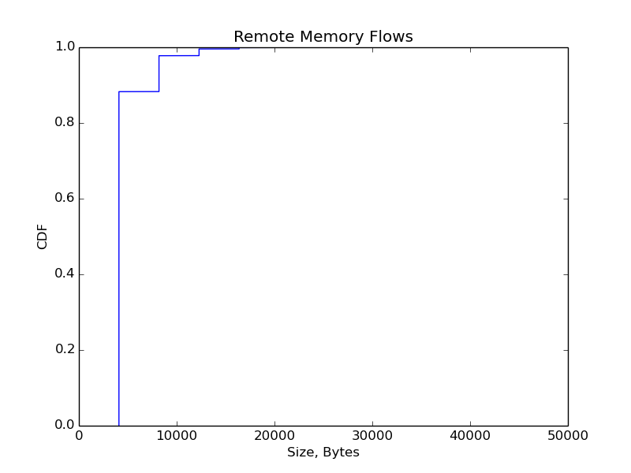|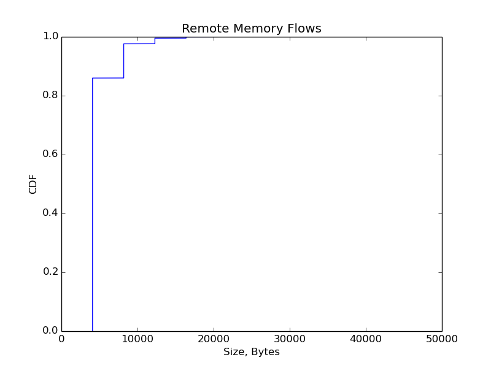

Disk Only
---------

Uncombined                            | Combined                                      |Delta = 1000
--------------------------------------|-----------------------------------------------|----------------------------------------------------------
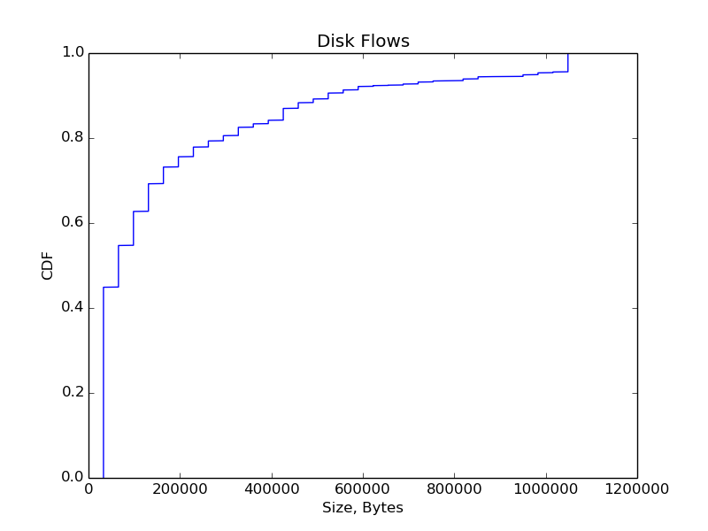 |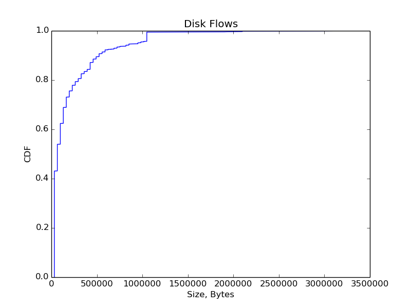 |

All Flows
---------

Uncombined                            | Combined                                      |Delta = 1000
--------------------------------------|-----------------------------------------------|----------------------------------------------------------
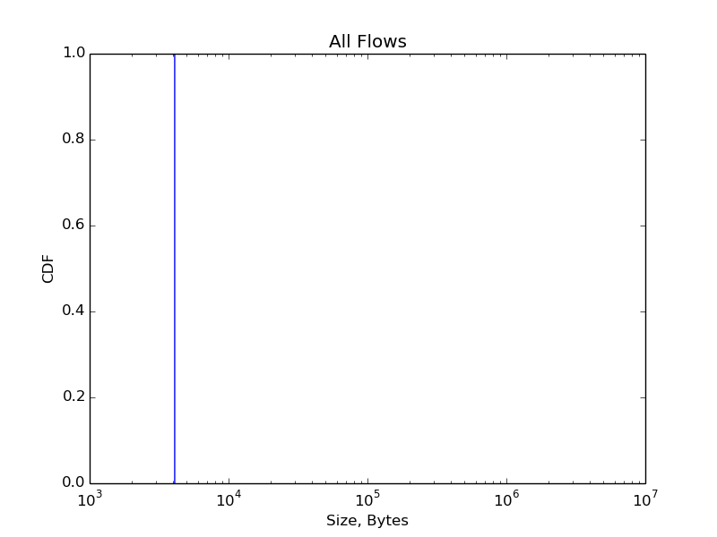        |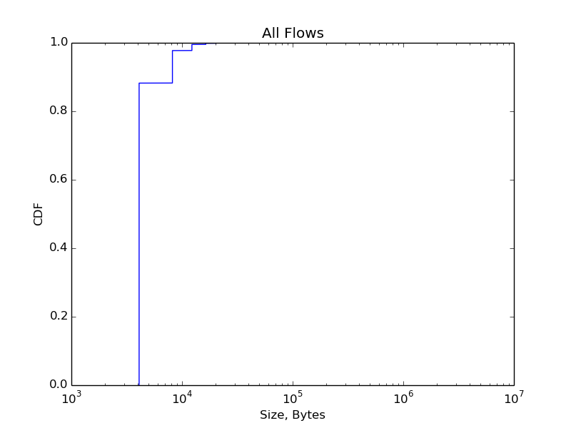        |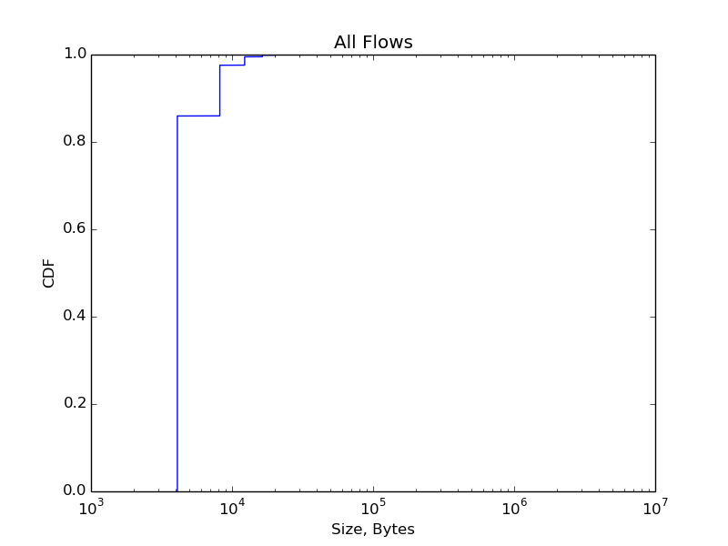

Interarrivals
=============

Uncombined                                                            | Combined                                                                       |Delta = 1000
----------------------------------------------------------------------|--------------------------------------------------------------------------------|----------------------------------------------------------
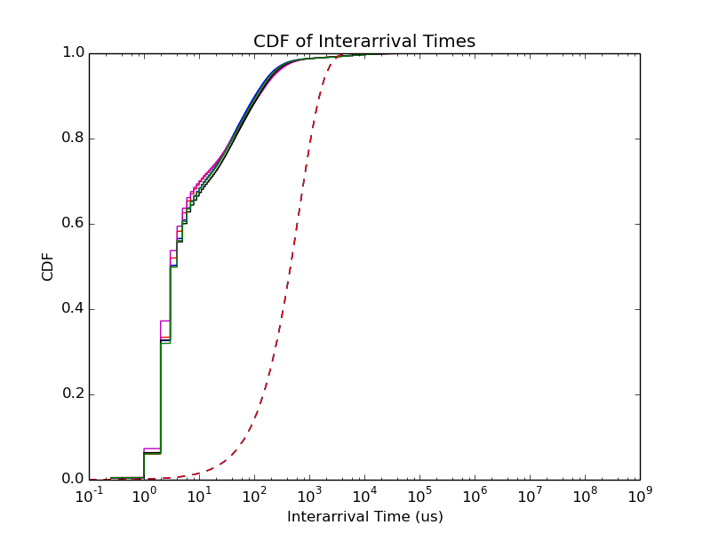| |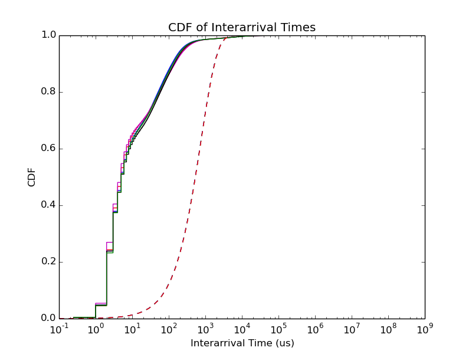
             | 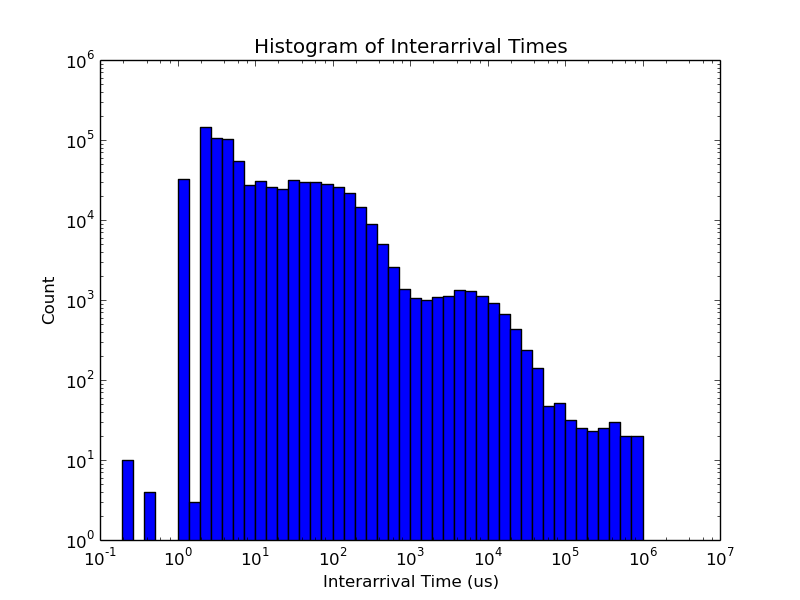             |             

Traffic Volume
==============

Uncombined                                          | Combined                                                      |Delta = 1000
----------------------------------------------------|---------------------------------------------------------------|----------------------------------------------------------
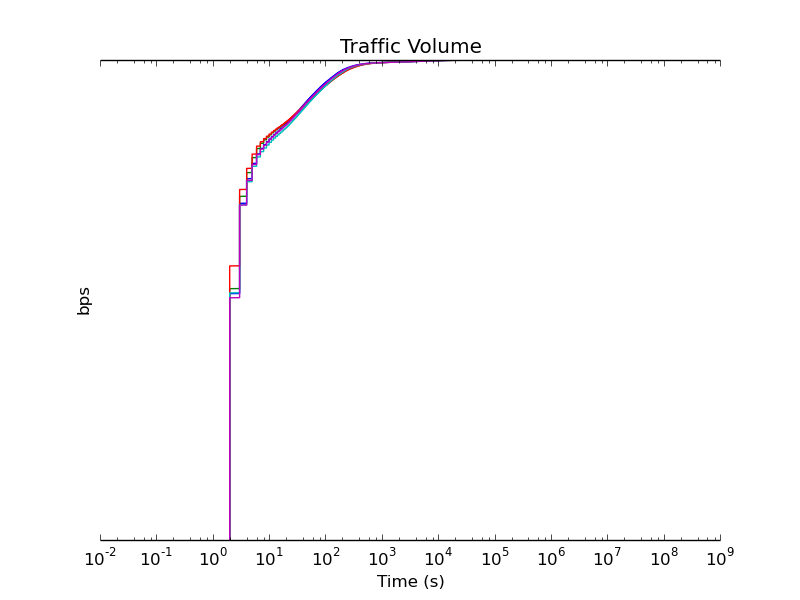      | 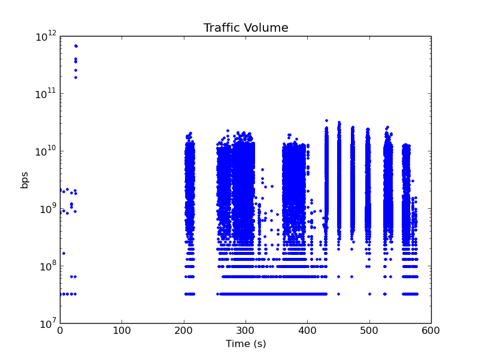|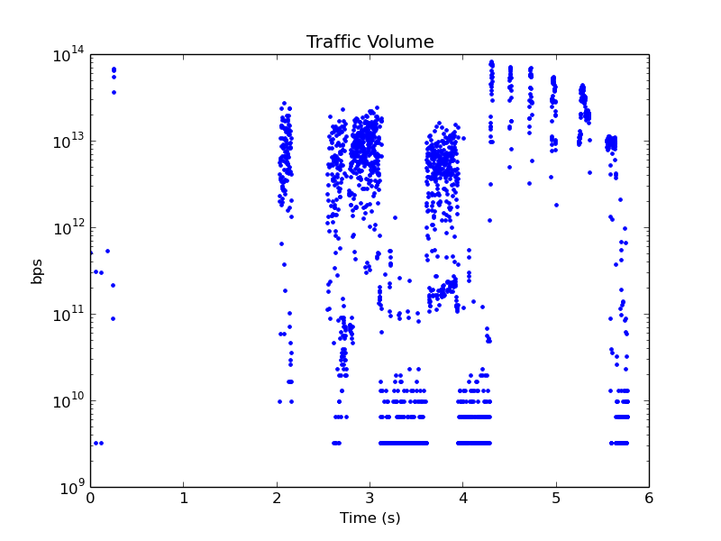
  | |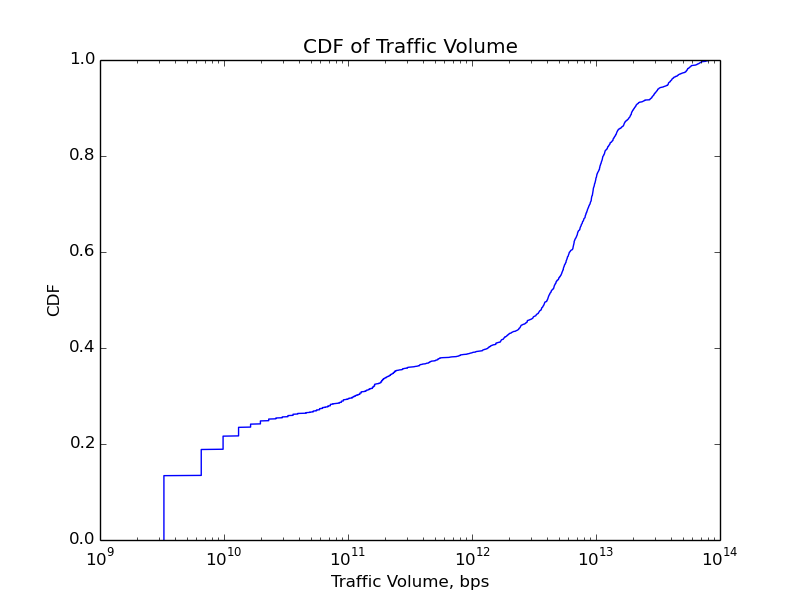
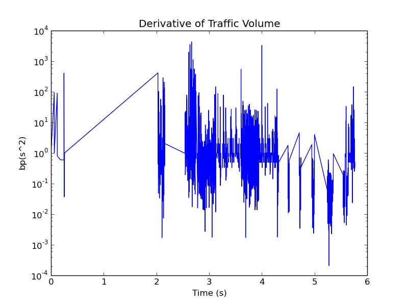  | |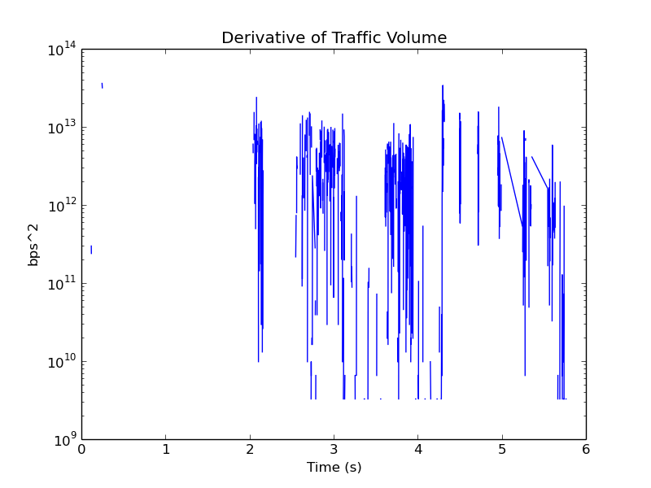

